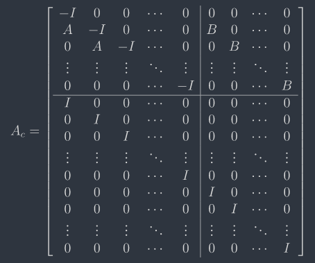

# Eigen-quadratic-programming

quadratic-programming with Eigen

### Standard QP problem

### MPC problem

### MPC to QP

Hessian matrix P is equal to

Gradient vector q is equal to

Linear constraint matrix A is equal to

Upper and lower bound are equal to

### Test Example

### OSQP

- run time	1.21e-04 s

  

